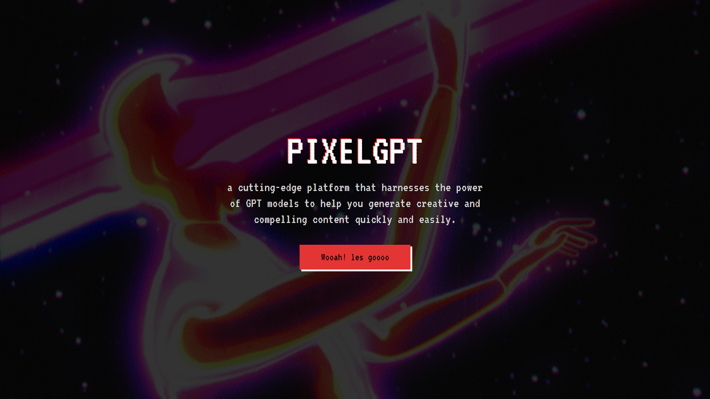
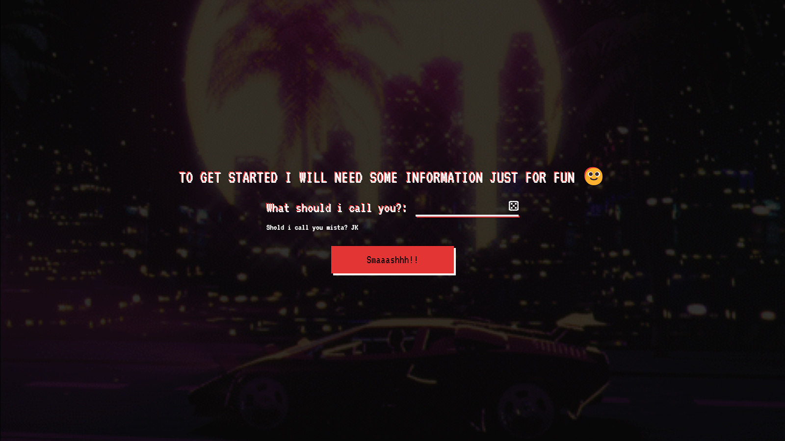
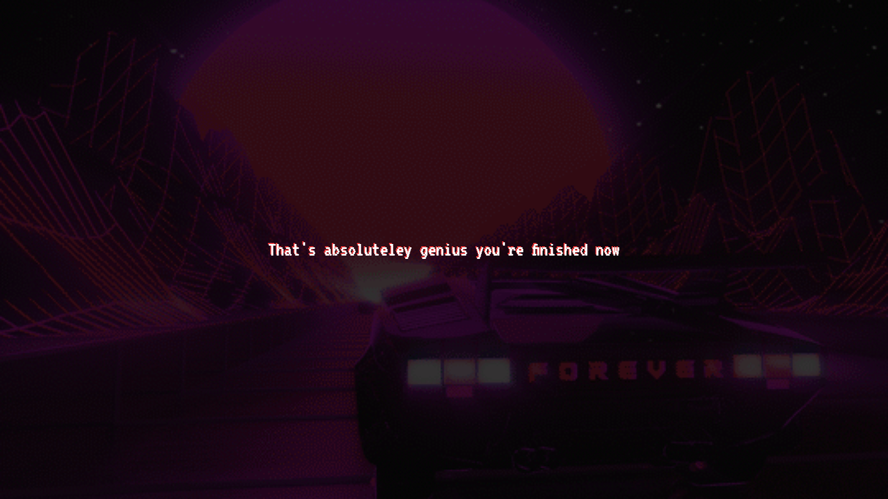

# PIXELGPT

PIXELGPT is a website created with React that functions like ChatGPT. It allows users to enter a prompt and receive a response. The website has a pixelated design with gif backgrounds. 

## Features

- Pixelated design
- Welcome screen
- Name input page
- Animated pages using framer-motion
- Integration with the OpenAI API from Rapid API

## Screenshots

Here are some screenshots of PIXELGPT:

1. 
2. 
3. 

##Website 
[pixelGPT Demo Website](https://pixelgpt.netlify.app)

## Contribution

If anyone wants to contribute to PIXELGPT, feel free to submit a pull request. We welcome any improvements or additional features you'd like to add!

